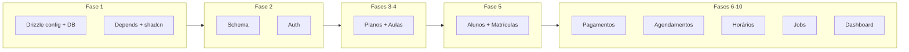

# Plano de desenvolvimento - Boxeapp MVP

Base: [.cursor/docs/PRD.md](.cursor/docs/PRD.md). Estado atual: Next.js 16, Tailwind, Drizzle + pg instalados, um componente shadcn (Button), Docker e workflow de deploy prontos. **Não** há: Drizzle config/schema, NextAuth, react-hook-form, zod, date-fns, páginas de negócio.

**Premissa importante:** O webapp é um **PWA mobile-first**. Todas as fases devem considerar design responsivo voltado principalmente para mobile: componentes touch-friendly (min-height 44px), layout com drawer em mobile (sidebar em desktop), tabelas viram cards em mobile, modais fullscreen em mobile, inputs grandes e legíveis.

---

## Visão da ordem de execução

---

## FASE 1: Concluir setup do projeto (1-2 dias)

**Já feito:** Next.js 16, Tailwind, Drizzle + pg, `lib/utils.ts`, `components/ui/button.tsx`, Dockerfile, docker-compose (dev/prod), workflow deploy, `.env.example`.

**Fazer:**

1. **Drizzle** ✅ *Concluído*

  - Criar `drizzle.config.ts` (driver pg, schema em `./lib/db/schema.ts`, out `./drizzle`).
  - Criar `lib/db/index.ts` (export do client Drizzle usando `DATABASE_URL`).
  - Em `package.json`: scripts `db:generate`, `db:migrate`, `db:studio` (drizzle-kit).

2. **Dependências** ✅ *Concluído*

  - Instalar: `next-auth`, `@auth/drizzle-adapter` (ou adapter manual), `react-hook-form`, `@hookform/resolvers`, `zod`, `date-fns`, `bcryptjs` + `@types/bcryptjs` (seeds).
  - **PWA**: `next-pwa` ou `@ducanh2912/next-pwa` para service worker e manifest.

3. **shadcn/ui** ✅ *Concluído*

  - Adicionar componentes usados no PRD: `input`, `label`, `card`, `table`, `form`, `select`, `checkbox`, `badge`, `dropdown-menu`, `dialog`, `alert`, `tabs`, `sheet` (drawer mobile), `drawer` (opcional). Comando: `npx shadcn@latest add <component>`.

4. **PWA - Configuração mobile-first**

  - Criar `public/manifest.json` (nome, short_name, description, start_url, display: "standalone", theme_color, background_color, ícones).
  - Criar ícones PWA em `public/icons/` (192x192, 512x512, favicon, apple-touch-icon).
  - Configurar `next.config.ts` com `next-pwa` (ou usar `@ducanh2912/next-pwa` com `withPWA`).
  - Em `app/layout.tsx`: meta tags viewport (`width=device-width, initial-scale=1, maximum-scale=1, user-scalable=no`), theme-color, apple-mobile-web-app-capable.
  - Service worker: configurar cache de assets estáticos e rotas; estratégia NetworkFirst para API, CacheFirst para assets.

5. **Mobile-first CSS/Tailwind** ✅ *Concluído*

  - Garantir que `globals.css` e componentes usam classes mobile-first (ex.: `flex-col md:flex-row`, `text-sm md:text-base`).
  - Botões e inputs: tamanhos mínimos touch-friendly (min-height 44px, padding adequado).

6. **Ambiente** ✅ *Concluído*

  - Garantir que com `docker compose -f docker-compose.dev.yml up -d postgres` (ou o compose de dev que você usa) o Postgres sobe; criar `.env.local` a partir de `.env.example` com `DATABASE_URL` apontando para `localhost:5432`.

---

## FASE 2: Schema e autenticação (2 dias)

1. **Schema Drizzle** (`lib/db/schema.ts`) ✅ *Concluído*

  - Tabelas conforme PRD seção 3: `users`, `planos`, `aulas`, `planos_aulas`, `alunos`, `matriculas`, `matriculas_aulas`, `pagamentos`, `agendamentos`.
  - Enums: tipo plano (INDIVIDUAL, COLETIVO), status aluno (ATIVO, INATIVO, SUSPENSO), status matrícula (ATIVA, CANCELADA, SUSPENSA), status pagamento (PENDENTE, PAGO, ATRASADO, CANCELADO), status agendamento (AGENDADO, PRESENTE, AUSENTE, CANCELADO), tipo agendamento (AUTOMATICO, MANUAL).
  - Campos: UUIDs, `planos.qtd_dias` (integer, default 3), `matriculas_aulas.horario` e `dias_semana` (nullable), demais conforme PRD.
  - Relações entre tabelas (references) e Drizzle Relations para queries com `with`.
  - Constraint única em `agendamentos`: `(aula_id, aluno_id, data, horario)`.

2. **Migrations** ✅ *Concluído*

  - Rodar `npm run db:generate` e `npm run db:migrate` (local contra Postgres do compose). Migration gerada em `drizzle/0000_new_rocket_racer.sql`; aplicar quando Postgres estiver disponível com `DATABASE_URL` correta.

3. **Seeds** ✅ *Concluído*

  - Script `src/lib/db/seed.ts` que cria um usuário admin (email + hash bcrypt da senha) na tabela `users`. Executável com `npm run db:seed` ou `tsx src/lib/db/seed.ts`.
  - Suporta variáveis de ambiente: `ADMIN_EMAIL`, `ADMIN_PASSWORD`, `ADMIN_NAME` (valores padrão se não definidos).
  - Verifica se usuário já existe antes de criar.

4. **NextAuth** ✅ *Concluído*

  - `src/app/api/auth/[...nextauth]/route.ts`: Credentials Provider implementado; compara email/senha com `users` (via Drizzle); session com id/email/name.
  - `src/lib/auth.ts`: `getServerSession`, `requireAuth`, `getUserId` helpers para proteger rotas e obter dados da sessão.
  - `src/middleware.ts`: Middleware configurado para proteger rotas `/dashboard`, `/planos`, `/aulas`, `/alunos`, `/pagamentos`, `/agendamentos`; redireciona não autenticados para `/login`.
  - `src/types/next-auth.d.ts`: Tipos customizados para Session, User e JWT com id, email e name.

5. **Login** ✅ *Concluído*

  - Página `src/app/login/page.tsx`: formulário (email, senha) com react-hook-form + zod implementado; submit chama `signIn("credentials", ...)`; redirect para `/dashboard` em sucesso.
  - Design mobile-first: inputs com `min-h-[44px]` (touch-friendly), layout responsivo com Card.
  - Validação com zod: email válido e senha obrigatória.
  - Tratamento de erros: exibe mensagens de erro amigáveis.
  - `src/components/providers/session-provider.tsx`: SessionProvider configurado no layout para suporte ao NextAuth no cliente.

---

## FASE 3: CRUD de Planos (1-2 dias) ✅ *Concluído*

1. **Queries** em `lib/db/queries/planos.ts`: `getAll`, `getById`, `create`, `update`, `delete` (e listar com aulas vinculadas, se necessário para o form).
2. **Server Actions** em `app/(dashboard)/planos/actions.ts` (ou `lib/actions/planos.ts`): create, update, delete; validação com zod; chamar queries.
3. **Layout dashboard (mobile-first)**

  - Grupo de rotas `(dashboard)`: `app/(dashboard)/layout.tsx` com:
    - **Mobile**: drawer/sheet lateral (componente `Sheet` do shadcn) com botão hamburger no topo; menu oculto por padrão, abre ao clicar.
    - **Desktop**: sidebar fixa visível (breakpoint `md:` ou `lg:`).
    - Links: Planos, Aulas, Alunos, Pagamentos, Agendamentos, Dashboard.
    - `<SessionProvider>` se necessário; ler sessão no layout.
    - Header com título da página atual e botão menu (mobile).

4. **Páginas**

  - `app/(dashboard)/planos/page.tsx`: listagem (Server Component buscando planos).
  - `app/(dashboard)/planos/novo/page.tsx`: formulário de criação (PlanoForm).
  - `app/(dashboard)/planos/[id]/editar/page.tsx`: formulário de edição (mesmo PlanoForm, carregar por id).

5. **Componentes (mobile-first)**

  - `PlanosList`: 
    - **Mobile**: cards (um plano por card) com informações principais e botões de ação; swipe actions opcional.
    - **Desktop**: tabela responsiva (`table` do shadcn) com colunas nome, tipo, valor, qtd_dias, ativo, ações.
    - Usar `hidden md:table` para tabela e `md:hidden` para cards em mobile.
  - `PlanoForm`: campos nome, tipo (select), valor, qtd_dias, ativo; inputs com tamanho touch-friendly (min-height 44px); submit via Server Action. Reutilizar em novo e editar.

---

## FASE 4: CRUD de Aulas (1-2 dias)

1. **Queries** em `lib/db/queries/aulas.ts`: getAll, getById, getByPlanoId (aulas de um plano), create, update, delete.
2. **Server Actions** para aulas (create, update, delete) e para vínculo planos-aulas (associar/desassociar aulas a um plano).
3. **Páginas**: listagem, novo, [id]/editar (mesmo padrão do Planos).
4. **Componentes (mobile-first)**

  - `DiasSemanaSelector`: grid de checkboxes Seg–Dom (valores 0–6 ou 1–7 conforme PRD: seg=1); tamanho touch-friendly; layout `grid-cols-2 md:grid-cols-4` ou similar.
  - `HorarioInput`: input tipo time nativo (mobile-friendly) ou time picker customizado; tamanho adequado para touch.
  - `AulaForm`: nome, dias_semana (array), horario, duracao_minutos, capacidade_maxima, ativo; inputs com min-height 44px.
  - `AulasList`: 
    - **Mobile**: cards (uma aula por card) com informações e ações.
    - **Desktop**: tabela responsiva.

5. **Vínculo Planos–Aulas**

  - No formulário de plano (editar): seleção múltipla de aulas (buscar aulas, marcar as já vinculadas); Server Action para atualizar `planos_aulas`.

---

## FASE 5: CRUD de Alunos e Matrículas (3-4 dias)

1. **Queries**

  - `lib/db/queries/alunos.ts`: getAll (com filtros status, nome, telefone), getById com matrícula ativa, pagamentos recentes, presença.
  - `lib/db/queries/matriculas.ts`: createMatriculaCompleta (transação: aluno ou uso existente, matrícula, matriculas_aulas, primeiro pagamento, agendamentos 7 dias); getByAlunoId; atualizar matrícula.

2. **Server Actions**

  - Criar aluno; criar aluno + matrícula completa (novo cadastro); atualizar aluno; atualizar matrícula/horários.

3. **Páginas (mobile-first)**

  - `app/(dashboard)/alunos/page.tsx`: 
    - **Mobile**: lista de cards com filtros em drawer/sheet ou topo; busca rápida; ações ver perfil, editar em cada card.
    - **Desktop**: tabela com filtros em barra superior.
  - `app/(dashboard)/alunos/novo/page.tsx`: formulário multi-step mobile-friendly (stepper visual, botões grandes, navegação fácil); seções: dados pessoais → plano → aulas e horários → dia vencimento; preview e submit com transação.
  - `app/(dashboard)/alunos/[id]/page.tsx`: perfil com tabs mobile-friendly (scroll horizontal ou drawer); tabs: Dados e Matrícula, Pagamentos, Presença; botão "Editar Horários" fixo no bottom ou topo.

4. **Componentes (mobile-first)**

  - Formulário multi-step: stepper visual (mobile: horizontal scroll ou vertical stack); botões de navegação grandes (min-height 44px); seleção de plano e aulas com cards touch-friendly.
  - Exibição de matrícula ativa, lista de pagamentos e lista de presença: cards em mobile, tabelas em desktop; scroll infinito ou paginação touch-friendly.

5. **Lógica de criação**

  - Ao salvar novo aluno com matrícula: inserir aluno, matrícula (data_inicio = hoje), matriculas_aulas (uma por aula escolhida; horário/dias da aula ou customizados), primeiro pagamento (mês atual, PENDENTE), e gerar agendamentos para os próximos 7 dias (usando regras de dias da semana e unicidade).

---

## FASE 6: Gestão de Pagamentos (2-3 dias)

1. **Queries** em `lib/db/queries/pagamentos.ts`: listar com filtros (mês, status, aluno), getById, confirmar (atualizar valor_pago, data_pagamento, status = PAGO).
2. **Server Actions**: listar pagamentos (filtros), confirmar pagamento.
3. **Página (mobile-first)** `app/(dashboard)/pagamentos/page.tsx`:

  - **Mobile**: filtros em drawer/sheet ou topo colapsável; lista de cards (um pagamento por card) com informações principais e botão "Confirmar" grande.
  - **Desktop**: filtros em barra superior; tabela com aluno, matrícula, valor, vencimento, status, ação "Confirmar".

4. **Modal/Dialog (mobile-friendly)** `ConfirmarPagamentoDialog`:

  - **Mobile**: dialog fullscreen ou quase fullscreen; inputs grandes (min-height 44px); botões fixos no bottom.
  - **Desktop**: dialog modal centralizado.
  - Campos: valor esperado (pré-preenchido), valor pago (editável), data pagamento (date picker mobile-friendly), observações; submit chama action de confirmar.

5. **Dashboard (preparação)**

  - Cards de indicadores: total pagamentos pendentes do mês; valor total pendente (usar em Fase 10).

---

## FASE 7: Gestão de Agendamentos (3-4 dias)

1. **Queries** em `lib/db/queries/agendamentos.ts`: getByDia (agrupados por aula/horário), getBySemana; marcarPresenca (status PRESENTE/AUSENTE); adicionar aluno (tipo MANUAL); remover (status CANCELADO). Respeitar unicidade (aula_id, aluno_id, data, horario).
2. **Server Actions**: listar agendamentos do dia/semana; marcar presença; adicionar aluno a aula; remover aluno de aula.
3. **Página (mobile-first)** `app/(dashboard)/agendamentos/page.tsx`:

  - **Mobile**: filtro de data no topo (date picker mobile-friendly); lista vertical de cards por horário/aula; cada card: nome da aula, horário, lista de alunos com checkboxes grandes (min-height 44px) para presença; botões "Adicionar aluno" e "Remover" grandes e touch-friendly.
  - **Desktop**: filtro de data em barra superior; lista agrupada por horário/aula; tabela ou cards expandidos.

4. **Componentes (mobile-first)**:

  - `AgendamentoCard`: card mobile-friendly com uma aula e lista de alunos; scroll interno se necessário.
  - `AlunoPresencaItem`: item com checkbox grande (min-height 44px) e label clicável; indicador visual de status (presente/ausente).
  - `AdicionarAlunoDialog`: dialog fullscreen em mobile; seleção de aluno (busca rápida), aula/data/horário; botões grandes.

5. **Visão semanal (mobile-first, opcional)**: `app/(dashboard)/agendamentos/semana/page.tsx`

  - **Mobile**: grid vertical (um dia por vez com scroll horizontal) ou lista de dias com horários; ocupação visual com badges/cards pequenos.
  - **Desktop**: grid completo dia × horário com ocupação.

---

## FASE 8: Alteração de Horários (2 dias)

1. **Serviço** `lib/services/alteracao-horarios.ts`: `alterarHorariosMatricula(matriculaId, novosHorarios)`: calcular próximo vencimento (dia_vencimento da matrícula); deletar agendamentos com status AGENDADO entre hoje e vencimento; atualizar `matriculas_aulas`; recriar agendamentos com novos horários/dias até o vencimento. Validar conflitos (mesmo aluno, mesmo dia/horário).
2. **Server Action** que chama esse serviço e retorna quantidade de agendamentos atualizados.
3. **Componente (mobile-friendly)** `EditarHorariosDialog`:

  - **Mobile**: dialog fullscreen ou quase fullscreen; listar aulas da matrícula em cards; por aula: seletor de dias da semana (grid touch-friendly) e input de horário grande; preview antes de salvar; botões grandes no bottom.
  - **Desktop**: dialog modal centralizado.

4. **Integração** no perfil do aluno: botão "Editar Horários" grande e touch-friendly; abre o modal; toast com resultado (ex.: "X agendamentos atualizados").

---

## FASE 9: Jobs e automações (2 dias)

1. **Lógica em** `lib/jobs/`:

  - `gerar-pagamentos.ts`: matrículas ATIVAS; para cada uma, criar registro em `pagamentos` (mês seguinte, valor do plano, data_vencimento conforme dia_vencimento, PENDENTE). Timezone America/Sao_Paulo.  
  - `gerar-agendamentos.ts`: matrículas ATIVAS; para cada matrícula e cada `matriculas_aulas`, gerar agendamentos para os próximos 7 dias conforme dias_semana e horário; inserir apenas se não existir (unicidade).  
  - `atualizar-status.ts`: (1) agendamentos do dia com status AGENDADO → AUSENTE; (2) pagamentos PENDENTES com data_vencimento &lt; hoje → ATRASADO.

2. **Route Handlers** em `app/api/cron/gerar-pagamentos/route.ts`, `gerar-agendamentos/route.ts`, `atualizar-status/route.ts`: método POST; validar header (ex.: `Authorization: Bearer CRON_SECRET`); chamar a lógica correspondente; retornar JSON de resumo.
3. **Produção:** documentar opção A (GitHub Actions scheduled workflows chamando essas rotas) e opção B (node-cron dentro do container).

---

## FASE 10: Dashboard e indicadores (1-2 dias)

1. **Queries** em `lib/db/queries/dashboard.ts`: getTotalAlunosAtivos, getPagamentosPendentesMes, getAgendamentosHoje, getTaxaPresencaMes (conforme PRD 4.5).
2. **Página (mobile-first)** `app/(dashboard)/page.tsx`:

  - **Mobile**: grid de cards em coluna única (`grid-cols-1`); cada card ocupa largura total; scroll vertical.
  - **Desktop**: grid de cards responsivo (`grid-cols-2 lg:grid-cols-4`).
  - Server Component que busca esses indicadores e exibe em cards (`StatsCard`).

3. **Componentes (mobile-first)**:

  - `StatsCard`: card reutilizável com padding adequado para mobile; texto legível em telas pequenas; ícones e valores bem espaçados.
  - Gráfico de presença (opcional): usar `recharts` ou `chart.js` com responsividade; em mobile, gráfico simplificado ou scroll horizontal.

4. **Menu/navegação**: link "Dashboard" apontando para `/dashboard` (raiz do grupo (dashboard)); destacado no menu mobile/desktop.

---

## FASE 11: Melhorias de UX e PWA (1-2 dias)

**Mobile-first e PWA:**

1. **Loading states (mobile-friendly)**

  - Skeletons nas listagens (cards skeleton em mobile, tabela skeleton em desktop).
  - Spinner em botões de submit (tamanho adequado para mobile).
  - Pull-to-refresh em listas (usar `react-pull-to-refresh` ou similar).

2. **Toasts e notificações**

  - Instalar `sonner`; envolver app com `<Toaster />` (posição bottom em mobile, top-right em desktop).
  - Sucesso/erro nas actions com mensagens claras e curtas.
  - Notificações push (opcional, futuro): configurar service worker para notificações.

3. **Validação e erros**

  - Mensagens amigáveis nos formulários (zod); exibir erros abaixo dos inputs em mobile.
  - Tratamento de erro nas Server Actions (retorno estruturado ou toast).
  - Feedback visual imediato (loading, sucesso, erro).

4. **PWA - Funcionalidades offline**

  - Service worker: cache de assets estáticos; estratégia NetworkFirst para dados dinâmicos.
  - Página offline: criar `app/offline/page.tsx` para quando não houver conexão.
  - Instalar prompt: configurar para aparecer após uso consistente.

5. **Responsividade (revisão final)**

  - Garantir que todas as tabelas viram cards em mobile (`hidden md:table` / `md:hidden`).
  - Menu lateral: drawer em mobile, sidebar fixa em desktop.
  - Formulários: inputs e botões com min-height 44px; espaçamento adequado.
  - Modais/dialogs: fullscreen ou quase fullscreen em mobile.

6. **Touch interactions**

  - Botões com área de toque adequada (min 44x44px).
  - Swipe actions em listas (opcional): swipe para ações rápidas.
  - Feedback tátil (haptic feedback) em ações importantes (usar API Vibration se disponível).

7. **Acessibilidade mobile**

  - Labels corretos em todos os inputs.
  - Navegação por teclado (mobile keyboard).
  - Contraste adequado (WCAG AA mínimo).
  - Tamanho de fonte legível (mínimo 16px para evitar zoom automático no iOS).

---

## FASE 12: Testes e deploy (2 dias)

1. **Testes manuais (mobile + desktop)**

  - Checklist manual dos fluxos do PRD em **dispositivos móveis** (iOS Safari, Chrome Android) e desktop:
    - Login (teclado mobile, autocomplete).
    - CRUD planos/aulas (formulários touch-friendly).
    - Cadastro aluno completo (multi-step em mobile).
    - Pagamentos (confirmação em mobile).
    - Agendamentos (presença com checkboxes grandes).
    - Alteração de horários (dialog em mobile).
    - Jobs (testar manualmente via rotas).
  - Testar PWA: instalação, funcionamento offline, service worker.

2. **Deploy**

  - Garantir migrations aplicadas em produção e `DATABASE_URL`, `NEXTAUTH_SECRET`, `NEXTAUTH_URL`, `CRON_SECRET` configurados na VPS/Portainer.
  - Deploy já automatizado (workflow existente); configurar cron jobs em produção (GitHub Actions schedule ou node-cron no container).
  - Verificar que PWA funciona em produção (HTTPS obrigatório): manifest.json acessível, service worker registrado, ícones corretos.

3. **Documentação**

  - README com variáveis de ambiente, como rodar dev (compose + npm run dev), e guia básico de uso.
  - Documentar instalação PWA (como adicionar à tela inicial em iOS/Android).
  - Screenshots mobile e desktop da aplicação.

---

## Ordem recomendada e dependências

| Fase | Depende de | Entregável principal                                |

| ---- | ---------- | --------------------------------------------------- |

| 1    | —          | Drizzle config, lib/db, deps, shadcn                |

| 2    | 1          | Schema, migrations, seeds, NextAuth, login          |

| 3    | 2          | CRUD Planos + layout dashboard                      |

| 4    | 2, 3       | CRUD Aulas + vínculo planos-aulas                   |

| 5    | 2, 3, 4    | Alunos + matrícula completa + agendamentos iniciais |

| 6    | 2, 5       | Pagamentos + confirmação + indicadores              |

| 7    | 2, 5       | Agendamentos do dia + presença + add/remove aluno   |

| 8    | 5, 7       | Alteração de horários (serviço + UI)                |

| 9    | 2, 5, 6, 7 | Jobs (lib/jobs + rotas /api/cron)                   |

| 10   | 2, 5, 6, 7 | Dashboard com cards de indicadores                  |

| 11   | 3–10       | Skeletons, toasts, responsivo, a11y                 |

| 12   | 1–11       | Checklist, deploy, README                           |

Iniciar pela **Fase 1** (Drizzle config + dependências + shadcn) e em seguida **Fase 2** (schema + auth); depois seguir na ordem 3 → 12. Cada fase pode ser quebrada em tarefas menores (por exemplo, Fase 5 em queries → actions → listagem → formulário novo → perfil).